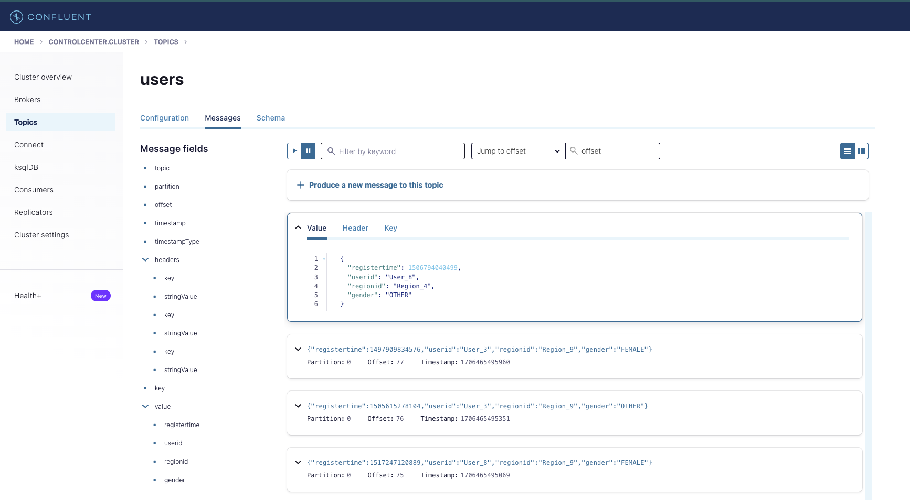
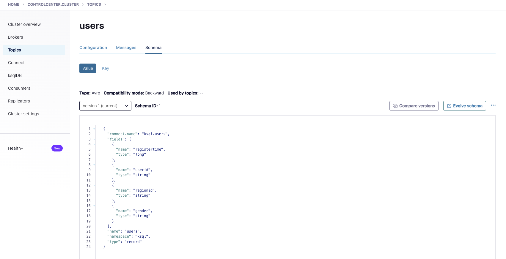
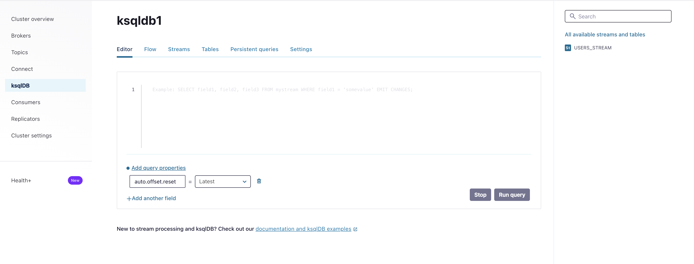

# Kafka - Práctica Guiada

## Prerrequisitos

* Docker Instalado: Para facilitar la práctica y el manejo montaremos nuestro propio "cluster" de Kafka en contenedores docker.

  [Instala Docker](https://docs.docker.com/get-docker/)

* JDK 11+ Instalado
* Maven Instalado

**Nota:** Para la instalación de SDKs mi recomendación es usar [SDKman](https://sdkman.io/)

## Organización del Repositorio

El repositorio estará organizado en carpetas, por temática (API), dentro de la cual encontraréis una
con el ejercicio propuesto a resolver y otra con el ejercicio resuelto.

El proyecto contiene bash script, código Python y código Java organizado en dos módulos Maven, para 
compilar el proyecto situarse en la carpeta root y ejecutar:

````bash
mvn clean install
````

## Arrancando el Clúster

Abre la carpeta _**1.Environment**_ :

Para la ejecución de un cluster multinodo completo ejecuta:

```bash
docker-compose up -d
```

## Admin API

En este apartado veremos como setear algunas de las propiedades basicas de Kafka.

Para ver el listado de todas las configuraciones posibles:

[Kafka Broker-Level Config](http://kafka.apache.org/10/documentation.html#brokerconfigs)

[Kafka Topic-Level Configs](http://kafka.apache.org/10/documentation.html#topicconfigs)

### Settings Básicos

Utilizaremos el comando kafka-configs que nos da la instalación de kafka para comprobar el estado de
algunos settings básicos de nuestro clúster, para ello deberemos ejecutar dicho comando dentro de
cualquiera de nuestros broker.

Por tanto lo primero que necesitaremos será habilitar una consola interactiva dentro del contenedor
de uno de nuestros broker para lo que ejecutamos:

```bash
docker exec -it broker-1 /bin/bash
```

Una vez dentro ejecutaremos el comando **kafka-configs** para listar la configuración de brokers
activa en este momento:

```bash
kafka-configs --bootstrap-server broker-1:29092 --entity-type brokers --describe --all
```

### Ejercicio 1 - Administración de Configuración básica del clúster desde línea de comandos

````text
1. Utiliza el comando **kafka-configs** para setear la propiedad _message.max.bytes_ a _512_ en el broker 1

2. Utiliza el comando **kafka-configs** para comprobar el efecto de tu acción.

3. Utiliza el comando **kafka-configs** para setear la propiedad _message.max.bytes_ a _512_ en todos los brokers

4. Revierte la propiedad al valor por defecto para todos los broker.

5. ¿Qué pasa si usa configuración solo existe en un broker e intentamos borrarla de todos a la vez?, ¿Testealo con los scripts anteriores?
````

### Creación y Administración de un Topic

Utilizaremos el comando **kafka-topics** para crear y administrar topics dentro de nuestro cluster:

Para monitorizar lo que está pasando en nuestro cluster, abriremos el log de cada broker en una
consola aparte ejecutando:

````bash
docker logs -f broker-<id>
````

Dentro del contenedor (recuerda docker exec...) de cual quiera de nuestros broker ejecutaremos:

````bash
kafka-topics --bootstrap-server broker-1:29092 --create --topic my-topic --partitions 1 --replication-factor 1 --config max.message.bytes=64000 --config flush.messages=1
````

Vamos a modificar el numero de particiones y replicas de nuestro topic y observemos lo que pasa:

Para el número de particiones:

````bash
kafka-topics --bootstrap-server broker-1:29092 --alter --topic my-topic --partitions 2
````

El incremento de réplicas más "tricky", necesitaremos reasignar la réplica de cada partición a
mano (algo a evitar tanto como sea posible).

Primero necesitamos saber cual es la configuración actual del topic:

```bash
kafka-topics --bootstrap-server broker-1:29092 --topic my-topic --describe
```

También necesitaremos un fichero JSON que describa esta reasignación,
increase-replication-factor.json:

```JSON
{
  "version": 1,
  "partitions": [
    {
      "topic": "my-topic",
      "partition": 0,
      "replicas": [
        1,
        3,
        2
      ]
    },
    {
      "topic": "my-topic",
      "partition": 1,
      "replicas": [
        2,
        3,
        1
      ]
    }
  ]
}
```

Para crear el archivo dentro de nuestro broker podemos usar el comando:

```bash
cat << EOF > increase-replication-factor.json
```

y pegar el contenido del mensaje en el prompt

Por último ejecutaremos el comando:

```bash
kafka-reassign-partitions --bootstrap-server broker-1:29092 --reassignment-json-file    increase-replication-factor.json --execute
```

### Ejercicio 2 - Administración de Topics

````text
1. Crea un topic con 1 particion, factor de replica 1, y que sincronice tras 5 mensajes

2. Cambia el número de particiones a 3 y reasigna la replicación de manera óptima.

3. Cambia la configuración de sincronizacón para que esta se haga tras cada mensaje.

4. Experimenta matando y levantando brokers, ¿Crees que tu asignación del factor de replica fue adecuada?
````

## Producer / Consumer API

### Console Producer

Primero crea un topic **console-example** con 3 particiones y factor de réplica 3.

Produciremos varios mensajes en el topic mediante el comando kafka-console-producer y observaremos el comportamiento:

El mensaje a producir será uno simple que solo contendrá un id como body:

```JSON
1,{"id": "1"}
```

```bash
kafka-console-producer --bootstrap-server broker-1:29092 --topic console-example --property "parse.key=true" --property "key.separator=,"
```

Ahora crearemos un consumidor de consola:

```bash
kafka-console-consumer --bootstrap-server broker-1:29092 --topic console-example --property print.key=true --from-beginning
```

¿Qué pasa cuando este arranca?:

<details>
  <summary><b>Solución</b></summary>

¡El consumidor consume todos los mensajes!.
</details>

¿Que pasara si añadimos otro consumidor?

<details>
  <summary><b>Solución</b></summary>

¡Tenemos dos consumidores consumiendo exactamente los mismos mensajes!.
</details>


Ahora introduciremos dos consumidores formando un grupo de consumo:

```bash
kafka-console-consumer --bootstrap-server broker-1:29092 --topic console-example --property print.key=true --from-beginning  --consumer-property group.id=console-group-1
```

Observad el rebalanceo y particionado que se produce mediante la partition key elegida. ¿Qué casos de uso encontramos para esta funcionalidad?.

### Ejercicio1 - Console Producer / Consumer

````text
Necesitamos crear un productor para que un operador desde consola introduzca las lecturas de n (15??) medidores de temperatura de una sala.

Cada lectura la recibira un dispositivo distinto simulado a través de un consumidor de consola independentiente, queremos que cada consumidor solo reciba la medición correspondiente a su medidor teniendo en cuenta que es muy importante preservar el orden de las mediciones tomadas.
````

### Java/Python Producer / Consumer

**Nota:** Si eliges Python como lenguaje, necesitarás instalar el módulo kafka

```bash
pip install confluent-kafka
```

Ejemplo de ejecución de los scripts python

```bash
python simpleProducer.py 127.0.0.1:9092 simple-topic
```

Observemos la configuración de la clase SimpleProducer. ¿Qué pasa en nuestro cluster si la ejecutamos "directamente"?

```text
Usa el comando kafka-topics para ver que ha pasado con nuestro simple-topic
```

Es momento ahora de crear nuestro primer consumidor. ¿Sabrías decir que pasará cuando arranquemos nuestro SimpleConsumer1?

¿Que pasará si arrancamos SimpleConsumer2 y SimpleConsumer3? (o más instancias de simpleConsumer.py)

<details>
  <summary><b>Solución</b></summary>

Estarán preparados para consumir, pero no consumirán nada, ya que todos los mensajes han sido consumidos por en el arranque anterior y nuestros nuevos procesos pertenecen al mismo grupo de consumo.
</details>

¿Y si corremos de nuevo SimpleProducer?, ¿Habrá algún cambio en la manera de consumir?

<details>
  <summary><b>Solución</b></summary>

Los nuevos mensajes empezarán a ser consumidos por el proceso perteneciente al grupo que tenga la partición a la que corresponda el mensaje asignada. 
</details>

```text
Ejemplos python traidos desde:

https://github.com/confluentinc/confluent-kafka-python

```

### Ejercicio2 - Console Producer / Consumer

````text
Es tiempo ahora de volver a nuestro medidor de temperatura. Esta vez simularemos cada dispositivo en una clase productora equivalente.

De nuevo necesitamos que los eventos de cada medidor sean atendidos por un solo consumidor y en el orden establecido.
````

### Java Transactional Producer/Consumer (Exactly Once Semantics)

En la carpeta tx del punto 3.1 encontraremos un ejemplo de un productor consumidor transaccional, es decir que asegura una semantica Exactly Once!.

Hay que tener en cuenta que esta semántica solo esta garantizada out of the box en operaciones dentro del cluster es decir cuando consumimos un topic para producir en otro. 

De ese modo debemos asegurar la idempotencia de los mensajes que producimos, asegurar la entrega de los mismos (minimo de ACKS de cada réplica), además en la parte consumidora tendremos que asegurar la transacción en la producción a nuestro topic de salida (recordamos que produciremos en otro topic) poniendo el isolation level en READ_COMMITED, es decir solo consumiremos aquellos mensajes que vengan marcados como comiteados por el productor.

Para los casos en los que no escribamos en otro topic tendra que ser la lógica de consumo la que asegure la transaccionalidad en su parte.

**¡De este modo como veremos más adelante las APIs construidas por encima de producer consumer asegura esta semántica by the face!.**

#### TX Word Count

En este ejemplo TxMessageProducer produce dos textos, marcados con un id, es decir nos aseguramos la idempotencia en la producción (ver comentarios en las clases de configuración).

Más tarde TxWordCount consumirá los textos separando y contando las palabras de cada mensaje para producir idempotentemente la cuenta de cada palabra en un topic de salida. Para ello:

* Iniciaremos un productor en modo transaccional antes de empezar a consumir.
* En cada poll iniciaremos una nueva transacción
* Ejecutaremos nuestra lógica de consumo para luego mandar todos los commit de los offset consumidos en este poll con el consumer group asegurandonos de ese modo que tanto productor como consumidor han marcado el mensaje como procesado.

## Connect

En esta sección practicaremos con la administración de conectores source y sink.

Como primer paso vamos a comprobar el estado nuestro cluster de `Kafka Connect` para ello usaremos el [API de administración](https://docs.confluent.io/platform/current/connect/references/restapi.html).

Podemos acceder a esta `API` desde nuestra maquina.

nota: En caso de que vuestra distribución de docker no permita la comunicación con el contenedor podréis ejecutar los mismos comandos desde el mismo contenedor. Para entrar en él ejecutaremos:

`docker exec -it connect /bin/bash`

Una vez dentro comprobaremos el estado y versiones instaladas llamando:

`curl http://localhost:8083`

obtendremos una salida parecida a esta:

```json
{
  "version": "7.5.3-ccs",
  "commit": "9090b26369455a2f335fbb5487fb89675ee406ab",
  "kafka_cluster_id": "MkU3OEVBNTcwNTJENDM2Qg"
}
```

donde vemos la versión y commit del servidor y el id kafka cluster que hace de backend de el. Si obtenemos esta clase de respuesta es que nuestro cluster de connect esta preparado para trabajar.

Ahora comprobaremos los plugins instalados:

`curl http://localhost:8083/connector-plugins`

para una instalación limpia deberíamos obtener una salida parecida a esta:

```json
[
  {
    "class": "org.apache.kafka.connect.mirror.MirrorCheckpointConnector",
    "type": "source",
    "version": "7.5.3-ccs"
  },
  {
    "class": "org.apache.kafka.connect.mirror.MirrorHeartbeatConnector",
    "type": "source",
    "version": "7.5.3-ccs"
  },
  {
    "class": "org.apache.kafka.connect.mirror.MirrorSourceConnector",
    "type": "source",
    "version": "7.5.3-ccs"
  }
]
```

como vemos los únicos plugins instalados serán los correspondientes a `mirrorMaker``

y los conectores (recordad Aplicaciones corriendo dentro de nuestro cluster) que existen:

`curl http://localhost:8083/connectors`

obteniendo una salida vacía (no tenemos ninguna aplicación corriendo en nuestro cluster)

> Nota: Todos los comandos que vayamos ejecutando los podréis ejecutar como sh desde la carpeta 4. KafkaConnect
> Os recomiendo usar un entorno linux (Linux, MAC o WSL en el caso de usar windows), no olvideis dar permisos de ejecución a los scripts (chmox -x <ruta del script>)

### Datagen Source Connector

Como primer paso vamos a practicar como crear un conector source es decir uno que inserte datos en un topic kafka. Para ello utilizaremos el `Datagen Source Connector` un conector que nos permitirá generar dato sintético en un topic Kafka.

En este [link](https://www.confluent.io/hub/confluentinc/kafka-connect-datagen) podeis encontrar toda la documentación sobre el.

Para ello primero deberemos instalar el `plugin` de dicho conector en nuestro cluster connect, para ello usaremos el cliente `confluent-hub` ya instalado en nuestro contenedor.

`docker exec -it connect /bin/bash`

`confluent-hub install confluentinc/kafka-connect-datagen:0.6.3`

```sh
docker exec -it connect /bin/bash
[appuser@connect ~]$ confluent-hub install confluentinc/kafka-connect-datagen:0.6.3
The component can be installed in any of the following Confluent Platform installations:
  1. / (installed rpm/deb package)
  2. / (where this tool is installed)
Choose one of these to continue the installation (1-2): 1
Do you want to install this into /usr/share/confluent-hub-components? (yN) y


Component's license:
Apache License 2.0
https://www.apache.org/licenses/LICENSE-2.0
I agree to the software license agreement (yN) y

Downloading component Kafka Connect Datagen 0.6.3, provided by Confluent, Inc. from Confluent Hub and installing into /usr/share/confluent-hub-components
Detected Worker's configs:
  1. Standard: /etc/kafka/connect-distributed.properties
  2. Standard: /etc/kafka/connect-standalone.properties
  3. Standard: /etc/schema-registry/connect-avro-distributed.properties
  4. Standard: /etc/schema-registry/connect-avro-standalone.properties
  5. Used by Connect process with PID : /etc/kafka-connect/kafka-connect.properties
Do you want to update all detected configs? (yN) y

Adding installation directory to plugin path in the following files:
  /etc/kafka/connect-distributed.properties
  /etc/kafka/connect-standalone.properties
  /etc/schema-registry/connect-avro-distributed.properties
  /etc/schema-registry/connect-avro-standalone.properties
  /etc/kafka-connect/kafka-connect.properties

Completed
```

Eligiremos instalar desde el paquete rpm/deb (es decir desde el repositorio linux disponible en nuestro contenedor), en el path por defecto y que cambie todos los posibles ficheros de configuración de nuestro cluster.

Si comprobamos ahora la lista de plugins:

`curl http://localhost:8083/connector-plugins`

veremos que `Datagen Source Connector` sigue sin aparecer en la lista de disponibles. Esto es porque necesitamos reiniciar nuestro cluster para que pueda coger el nuevo código instalado. Lo haremos ejecutando:

```bash
docker compose restart connect
```

una vez reiniciado comprobamos de nuevo la lista de plugins:

`curl http://localhost:8083/connector-plugins`

observando que ahora si lo tenemos disponible:

```json
[
  {
    "class": "io.confluent.kafka.connect.datagen.DatagenConnector",
    "type": "source",
    "version": "null"
  },
  {
    "class": "org.apache.kafka.connect.mirror.MirrorCheckpointConnector",
    "type": "source",
    "version": "7.5.3-ccs"
  },
  {
    "class": "org.apache.kafka.connect.mirror.MirrorHeartbeatConnector",
    "type": "source",
    "version": "7.5.3-ccs"
  },
  {
    "class": "org.apache.kafka.connect.mirror.MirrorSourceConnector",
    "type": "source",
    "version": "7.5.3-ccs"
  }
]
```

Lo siguiente será crear una nueva instancia de nuestro conector (una aplicación corriendo en nuestro cluster connect). Para ello primero deberemos crear una configuración válida para él, para ello visitaremos la [Documentación de Referencia](https://github.com/confluentinc/kafka-connect-datagen/tree/master) del conector en Confluent Hub que en este caso nos lleva a un repositorio git, de la carpeta `config` del mismo extraemos esta configuracion de ejemplo:

```json
{
  "name": "datagen-users",
  "config": {
    "connector.class": "io.confluent.kafka.connect.datagen.DatagenConnector",
    "key.converter": "org.apache.kafka.connect.storage.StringConverter",
    "kafka.topic": "users",
    "quickstart": "users",
    "max.interval": 1000,
    "iterations": 10000000,
    "tasks.max": "1"
  }
```

Además de configuración especifica del conector, como que usamos el quickstart con el modelo `users` o las iteraciones y el intervalo de publicación de mensaje, vemos alguna configuración generica interesante:

1. `connector.class`: Clase que implementa el connector.
2. `kafka.topic`: Topic en el que publicará los mensajes (ojo esto es una configuración común pero no todos los conectores la llaman igual)
3. `key.converter`: Tipo que usaremos para la serialización de la key (en este caso string)
4. `task.max`: Numero máximo de tareas que se distribuiran en el cluster de connect.

para publicar esta configuración volveremos a usar el api de connect:

```bash
curl -d @"datagen-users.json" -H "Content-Type: application/json" -X POST http://localhost:8083/connectors
```

Con este curl estamos pasando un fichero que contiene la configuración para del connector, el verbo POST de HTTP nos indica que estamos en "modo creación"

> Nota: este comando debe ejecutarse desde la carpeta 4. KafkaConnect/DatagenSourceConnector
> En caso de estar ejecutando los curl desde el contenedor debereis copiar primero el fichero de configuración a la carpeta desde donde ejecutéis el curl, para ello debéis ejecutar:
> docker cp datagen-users.json connect:/home/appuser

Si ejecutamos ahora la consulta de connectores corriendo obtendriamos algo como esto:

`curl http://localhost:8083/connectors`

```json
["datagen-users"]
```
  
Ahora mismo ya podemos ver mensajes llegando a nuestro topic `users`, la manera mas facil de hacerlo es a traves de la instancia de `control-center` que tenemos disponible en nuestro entorno, para ellos solo debeis poner en vuestro navegador:

`http://localhost:9021`



otro dato importante de este conector es que por defecto esta haciendo uso de un schema (que previamente el ha configurado por nosotros), esto nos será especialmente util para el siguiente ejercicio. Podemos ver este esquema en la pestaña schema del topic:



Haciendo uso, de nuevo del api de connect podemos recibir la información importante del conector, parar, reiniciar, borrar, comprobar status de nuestro conector, etc:

Consulta Connector información:

`curl http://localhost:8083/connectors/datagen-users`

```json
{
  "name": "datagen-users",
  "config": {
    "connector.class": "io.confluent.kafka.connect.datagen.DatagenConnector",
    "quickstart": "users",
    "tasks.max": "1",
    "name": "datagen-users",
    "kafka.topic": "users",
    "max.interval": "1000",
    "key.converter": "org.apache.kafka.connect.storage.StringConverter",
    "iterations": "10000000"
  },
  "tasks": [
    {
      "connector": "datagen-users",
      "task": 0
    }
  ],
  "type": "source"
}
```

Status:

`curl http://localhost:8083/connectors/datagen-users/status`

```json
{
  "name": "datagen-users",
  "connector": {
    "state": "RUNNING",
    "worker_id": "connect:8083"
  },
  "tasks": [
    {
      "id": 0,
      "state": "RUNNING",
      "worker_id": "connect:8083"
    }
  ],
  "type": "source"
}
```

Este `endpoint` es quizá el mas importante ya que no solo no dará información de las tareas y los nodos en que corren estas sino que en caso de que alguna estuviera en estado de fallo podríamos ver los logs asociados al mismo.

ejemplo:

```json
{
    "name": "hdfs-sink-connector",
    "connector": {
        "state": "RUNNING",
        "worker_id": "fakehost:8083"
    },
    "tasks":
    [
        {
            "id": 0,
            "state": "RUNNING",
            "worker_id": "fakehost:8083"
        },
        {
            "id": 1,
            "state": "FAILED",
            "worker_id": "fakehost:8083",
            "trace": "org.apache.kafka.common.errors.RecordTooLargeException\n"
        }
    ]
}
```

Parada:

`curl -X PUT http://localhost:8083/connectors/datagen-users/stop`

Si comprobamos el status veriamos:

```json
{
  "name": "datagen-users",
  "connector": {
    "state": "STOPPED",
    "worker_id": "connect:8083"
  },
  "tasks": [],
  "type": "source"
}
```

Pausa (la aplicación sigue corriendo en nuestro servidor pero los productores estan parados):

```json
{
  "name": "datagen-users",
  "connector": {
    "state": "PAUSED",
    "worker_id": "connect:8083"
  },
  "tasks": [
    {
      "id": 0,
      "state": "PAUSED",
      "worker_id": "connect:8083"
    }
  ],
  "type": "source"
}
```

Resume (continuar donde los dejamos sin reiniciar):

`curl -X PUT http://localhost:8083/connectors/datagen-users/resume`

```json
{
  "name": "datagen-users",
  "connector": {
    "state": "RUNNING",
    "worker_id": "connect:8083"
  },
  "tasks": [
    {
      "id": 0,
      "state": "RUNNING",
      "worker_id": "connect:8083"
    }
  ],
  "type": "source"
}
```

Restart (reiniciar aplicacion):

`curl -X POST http://localhost:8083/connectors/datagen-users/restart`

```json
{
  "name": "datagen-users",
  "connector": {
    "state": "RUNNING",
    "worker_id": "connect:8083"
  },
  "tasks": [
    {
      "id": 0,
      "state": "RUNNING",
      "worker_id": "connect:8083"
    }
  ],
  "type": "source"
}
```

> Nota: Todas estas operaciones podrían hacerse a nivel de TASK añadiendo el task id al path:

`curl http://localhost:8083/connectors/datagen-users/tasks/0/status`

```json
{
  "id": 0,
  "state": "RUNNING",
  "worker_id": "connect:8083"
}
```

Delete (borrar aplicación de nuestro servidor):

`curl -X DELETE http://localhost:8083/connectors/datagen-users`

Si comprobamos los conectores de nuestro cluster veremos que ahora esta vacío.

### MySQL Sink Connector

En este ejemplo leeremos los datos que hemos ingestado con nuestro `datagen-users` en el topic `users` y volcaremos los datos en una tabla en una instancia de MySQL que hemos creado en nuestro entorno docke-compose (revisad el último servicio)

Para ello usaremos el [JDBC Sink Connector](https://www.confluent.io/hub/confluentinc/kafka-connect-jdbc)

Al igual que con el source connector lo primero que haremos es instalar el plugin:

`docker exec -it connect /bin/bash`

`confluent-hub install confluentinc/kafka-connect-jdbc:10.7.4`

```bash
The component can be installed in any of the following Confluent Platform installations:
  1. / (installed rpm/deb package)
  2. / (where this tool is installed)
Choose one of these to continue the installation (1-2): 1
Do you want to install this into /usr/share/confluent-hub-components? (yN) y


Component's license:
Confluent Community License
https://www.confluent.io/confluent-community-license
I agree to the software license agreement (yN) y

Downloading component Kafka Connect JDBC 10.7.4, provided by Confluent, Inc. from Confluent Hub and installing into /usr/share/confluent-hub-components
Detected Worker's configs:
  1. Standard: /etc/kafka/connect-distributed.properties
  2. Standard: /etc/kafka/connect-standalone.properties
  3. Standard: /etc/schema-registry/connect-avro-distributed.properties
  4. Standard: /etc/schema-registry/connect-avro-standalone.properties
  5. Used by Connect process with PID : /etc/kafka-connect/kafka-connect.properties
Do you want to update all detected configs? (yN) y

Adding installation directory to plugin path in the following files:
  /etc/kafka/connect-distributed.properties
  /etc/kafka/connect-standalone.properties
  /etc/schema-registry/connect-avro-distributed.properties
  /etc/schema-registry/connect-avro-standalone.properties
  /etc/kafka-connect/kafka-connect.properties

Completed
```

El conector JDBC necesita los drivers Java específicos de cada BBDD para poder conectar y operar con nuestro MySQL por tanto necesitamos proveerlos. En la carpetas `1.Environment/mysql` podeis encontrar el jar del driver en cuestion. Para copiarlo a nuestro contendor de MySQL:

`docker cp ../../1.Environment/mysql/mysql-connector-java-5.1.45.jar connect:/usr/share/confluent-hub-components/confluentinc-kafka-connect-jdbc/lib/mysql-connector-java-5.1.45.jar`

y reiniciamos el servicio de connect:

```bash
docker compose restart connect
```

una vez reiniciado comprobamos de nuevo la lista de plugins:

`curl http://localhost:8083/connector-plugins`

observando que ahora si lo tenemos disponible:

```json
[
  {
    "class": "io.confluent.connect.jdbc.JdbcSinkConnector",
    "type": "sink",
    "version": "10.7.4"
  },
  {
    "class": "io.confluent.connect.jdbc.JdbcSourceConnector",
    "type": "source",
    "version": "10.7.4"
  },
  {
    "class": "io.confluent.kafka.connect.datagen.DatagenConnector",
    "type": "source",
    "version": "null"
  },
  {
    "class": "org.apache.kafka.connect.mirror.MirrorCheckpointConnector",
    "type": "source",
    "version": "7.5.3-ccs"
  },
  {
    "class": "org.apache.kafka.connect.mirror.MirrorHeartbeatConnector",
    "type": "source",
    "version": "7.5.3-ccs"
  },
  {
    "class": "org.apache.kafka.connect.mirror.MirrorSourceConnector",
    "type": "source",
    "version": "7.5.3-ccs"
  }
]
```

para crear este conector de ejemplo usaremos esta configuracion:

```json
{
    "connector.class": "io.confluent.connect.jdbc.JdbcSinkConnector",
    "tasks.max": "1",
    "connection.url": "jdbc:mysql://mysql:3306/db?user=user&password=password&useSSL=false",
    "topics": "users",
    "auto.create": "true"
}
```

en la que proveemos los datos de conexion con nuestra instancia de mysql y dejamos al connector que haga el resto por nosotros.

Creamos el nuevo conector usando este fichero:

`curl -d @"mysql-users-sink.json" -H "Content-Type: application/json" -X POST http://localhost:8083/connectors`

y comprobamos la info de creacion:

`curl http://localhost:8083/connectors/mysql-users-sink`

```json
{
  "name": "mysql-users-sink",
  "config": {
    "connector.class": "io.confluent.connect.jdbc.JdbcSinkConnector",
    "tasks.max": "1",
    "topics": "users",
    "name": "mysql-users-sink",
    "auto.create": "true",
    "connection.url": "jdbc:mysql://mysql:3306/db?user=user&password=password&useSSL=false"
  },
  "tasks": [
    {
      "connector": "mysql-users-sink",
      "task": 0
    }
  ],
  "type": "sink"
}
```

usaremos comandos MySQL ejecutados dentro del contenedor para observar que es lo que esta pasando en la base de datos:

Podemos ver como el conector ha creado por nosotros una tabla que casa con el esquema de nuestro topic:

`docker exec mysql bash -c "mysql --user=root --password=password --database=db -e 'describe users'"`

|Field|Type|Null|Key|Default|Extra|
|:---:|:--:|:--:|:-:|:-----:|:---:|
|registertime|bigint|NO||NULL||
|userid|text|NO||NULL||
|regionid|text|NO||NULL||
|gender|text|NO||NULL||

> La configuracion auto.create del conector JDBC permite crear una tabla (digamos que ejecuta un DDL) basandose en el schema del topic pero siempre podremos indicarle entre otras propiedades la tabla y schema donde queramos que escriba
> para ver mas datos sobre las opciones de este conector podeís echar un ojo a la [referencia](https://docs.confluent.io/kafka-connectors/jdbc/current/sink-connector/sink_config_options.html#sink-config-options)

Y si lanzamos una `SELECT` sobre ella veremos como los datos van entrando:

`docker exec mysql bash -c "mysql --user=root --password=password --database=db -e 'select * from users'"`

|registertime|userid|regionid|gender|
|:----------:|:-------:|:---------:|:-------:|
|1512307237377|User_6| Region_4 |MALE|
|1513540605600|User_2|egion_9|FEMALE|
|1488636880843|User_3|Region_7|FEMALE|
|1499628245585|User_2|Region_4|FEMALE|
|1488634338238|User_8|Region_6|MALE|
|1490685074961|User_7|Region_8|OTHER|
|1507031407191|User_8|Region_7|OTHER|
|1488187488139|User_6|Region_7|MALE|
|1507527225929|User_4|Region_4|OTHER|
|1510335525396|User_5|Region_6|FEMALE|
|1498710904036|User_2|Region_1|FEMALE|
|1513067113343|User_3|Region_7|OTHER|
|1517154596503|User_9|Region_8|OTHER|
|1500203232171|User_9|Region_6|FEMALE|
|1505191909015|User_5|Region_2|FEMALE|
|1499977300831|User_3|Region_2|OTHER|
|1512542341250|User_5|Region_1|FEMALE|
|1492686190944|User_9|Region_6|MALE|
|1503564149605|User_4|Region_6|MALE|
|1496369347405|User_1|Region_3|MALE|
|1498294133831|User_1|Region_6|OTHER|
|1492314257633|User_9|Region_1|FEMALE|
|1507350446146|User_3|Region_3|MALE|
|1509665903160|User_1|Region_4|FEMALE|
|1499137040847|User_1|Region_6|OTHER|
|1510196176618|User_9|Region_2|OTHER|
|1496652002217|User_4|Region_7|FEMALE|
|1501175709291|User_1|Region_3|FEMALE|
|1512796318009|User_5|Region_1|OTHER|
|1516874972880|User_1|Region_3|MALE|
|1515303168952|User_6|Region_9|OTHER|
|1511455143265|User_8|Region_4|FEMALE|

### Creación de Entorno automatizado

Para poder tener como base para experimentar con KSQL y STREAMS con lo trabajado hasta ahora en la carpeta `1.Environment`teneis disponible el script `start.sh` que deja el entorno preparado hasta este punto.

Recuerda ejecutar el script de limpieza `clean.sh` antes de ejecutarlo para dejar el entorno local en un estado coherente.

> Nota: Este script es una manera de ponernos en un punto avanzado desde 0, la recomendación para el correcto aprendizaje es realizar todos los ejercicios en el orden propuesto.

## Kafka Streams

Toda la documentación oficial del API de Streams [aquí](https://kafka.apache.org/documentation/streams/)

Especial atención a los [conceptos basicos](https://kafka.apache.org/27/documentation/streams/core-concepts)

También digno de mencionar como todas las semánticas de entrega están soportadas por infraestructura mediante la propiedad de configuración **processing.guarantee**

### KStream vs KTable

Para el primer ejemplo buscaremos los básicos de Stream KTable y KStream, la mejor explicación grafica la podemos encontrar [aquí](https://www.confluent.io/blog/kafka-streams-tables-part-1-event-streaming/)

Podemos ver el stream como una foto en un momento dado del estado de un topic/partición, esta foto se está siendo constantemente actualizada (si procesamos en tiempo real) o bien en micro batches en una ventana de tiempo, como vemos en los gráficos de la docu oficial cada momento del stream representa un mensaje en la historia del topic. Por contra en la tabla podremos de un solo momento (en un solo offset) obtener la información agregada del estado de nuestro topic.

En nuestro primer ejemplo **KafkaStreamsWordCount** vemos como el simple concepto de Ktable simplifica y hace mucho más eficiente nuestro código.

1. Primero ve a la carpeta `.../Kafka/5.JavaKafkaStreamsAPI/src/main/java/org/ogomez/practica/streambasics`
2. Desde ahí ejecutaremos nuestro cídigo ejemplo `KafkaStreamsWordCount.java`.
   Ejemplo de ejecución con maven: `mvn exec:java -Dexec.mainClass="org.ogomez.practica.streambasics.KafkaStreamsWordCount"`
   Con esto tendremos corriendo nuestra primera aplicación Kafka Streams
3. Para producir algunos datos utilizaremos un `console producer`:
   1. Entraremos en el contenedor de un broker: `docker exec -it broker-1 /bin/bash`
   2. Ejecutamos nuestro console producer: `kafka-console-producer --bootstrap-server broker-1:29092 --topic wordcount-input-topic`
   3. Ahora podemos introducir mensajes por ejemplo `en un lugar de la mancha`
4. De la misma manera arrancamos nuestro `console consumer` y obervamos los resultados:
   1. Entraremos en el contenedor de un broker: `docker exec -it broker-1 /bin/bash`
   2. Ejecutamos nuestro console consumer: `kafka-console-consumer --bootstrap-server broker-1:29092 --topic wordcount-output-topic --property print.key=true --from-beginning  --consumer-property group.id=output-consumer --property "value.deserializer=org.apache.kafka.common.serialization.LongDeserializer"`
      Observad que en este caso estamos diciendo a nuestro consumidor que el tipo de dato a deserializar en un `Long` para que pueda mostrar correctamente la cuenta.

Que es lo que estamos viendo:

Cada mensaje que producimos se divide en palabras y vamos acumulando las veces que llegan a nuestro topic de entrada, de modo que cuando consumimos veremos como key la palabra y como valor el número de veces que la recibimos.

Que pasará si paramos nuestra aplicación KStreams, volvemos arrancarla y volvemos a producir "en un lugar de la mancha", ¿habrá perdido la cuenta?

<details>
  <summary><b>Solución</b></summary>
No, gracias a nuestro state store al arrancar nuestro KStream es capaz de recuperar la información que tenia anteriormente.
En este caso debido a que nuestra persistencia es en nuestro disco local (fijaros en la carpeta temp que cuelga de 5.JavaKafkaStreamsAPI) en arranque será capaz de reconstruir desde ahí, en caso de que la borraramos esta se reconstruiría a partir de los topic intermedios que empiezan por  `wordCount-KSTREAM-AGGREGATE-STATE-STORE`.
</details>

### Agregando Información de un Stream

Si nos fijamos en nuestro ejemplo **KafkaStreams** mediante un sencillo método (función lambda) aggregate podemos ir agregando, valga la redundancia, información que va llegando a nuestro topic.

Podemos simplificar más aún estos calculos gracias a la abstracción **KGroupedStream** (ejemplos **KafkaStreamGroupedKey**, **KafkaStreamsAggregate**) que conseguiremos aplicando **groupBy* a nuestro stream, sobre la que podemos aplicar funciones reduce, aggregate, flatmap, etc.

Para ejecutar este ejemplo solo debereis seguir las instrucciones del ejemplo anterior cambiando el nombre de la clase del paso 2 por `org.ogomez.practica.streambasics.KafkaStreamGroupedKey` o `org.ogomez.practica.streambasics.KafkaStreamsAggregate` dependiendo del caso.

¿Qué diferencia vemos entre nuestros dos ejemplos?

<details>
  <summary><b>Pista</b></summary>

¿Alguna diferencia en como suma?, ¿Qué pasa si dejamos algún tiempo sin consumir?
Fijaos en la linea 9 de KafkaStreamsAggregate.java
</details>

<details>
  <summary><b>Solución</b></summary>

Efectivamente el windowedBy descartará por defecto todos los mensajes que salgan de nuestra ventana de tiempo. Por tanto vemos como en el ejemplo de aggregate sumara todas las entradas de las keys producidas dentro de la ventana. Mientras que en la GroupedKey sumara todo lo que entre en el topic.

Más info sobre el "windowing" [aquí](https://kafka.apache.org/27/documentation/streams/core-concepts#streams_concepts_windowing)

</details>

### Joins

También podemos "cruzar los rayos" para ello usaremos la sintaxis de join de las que nos provee el DSL de Streams. Esto nos permitirá agregar información de dos o más topics en cualquier abstracción del [dsl](https://kafka.apache.org/27/documentation/streams/developer-guide/dsl-api.html#id11) de streams.

Información detalla y amigable de todas las posibilidades de Join [aquí](https://www.confluent.io/blog/crossing-streams-joins-apache-kafka/)

Otra cosa a tener en cuenta es que alguna de las operaciones sobre los streams son stateful, esto quiere decir que los procesadores guardaran información en un storage intermedio (normalmente disco local) del estado de las task ejecutadas, de modo que puedan recuperar y proseguir las operaciones donde las dejaron en caso de tener que reiniciarse.

Además esto nos provee de la interesante posibilidad de hacer queries interactivas sobre un stream, funcionalidad sobre la que se construye KSQL.

En nuestros ejemplos de **Movies** utilizaremos joins de streams sirviéndonos tanto de KTables  como de [GlobalKTables](https://kafka.apache.org/27/documentation/streams/developer-guide/dsl-api.html#streams_concepts_globalktable).

Utilizaremos  estos ejemplos para ver como de una manera sencilla podemos implementar nuestros propios [serializadores y serdes](https://kafka.apache.org/10/documentation/streams/developer-guide/datatypes), que no es más que la abstracción que agrupa en una sola clase el serializador y deserializdor. Para ello solo tendremos que exteneder e implementar algunos métodos, para dar la logica de mapeo desde el tipo de entrada a nuestro tipo de salida. Puedes ver un ejemplo en el paquete **movies.serializers**, y un ejemplo genérico de serialización POJO <-> JSON en el paquete **streamutils**

## KSQL

Existen dos maneras de interactuar con KSQL.

Como manera de mas fácil acceso podéis acceder a la UI a traves de `Control Center`

`http://localhost:9091`



La otra es a través del cliente KSQLDB al que podemos acceder por el contender que tenemos habilitado para ello

`docker exec -it ksql-db-cli /bin/bash``

`ksql http://ksqldb-server:8088`

Lo siguiente que haremos es algunas operaciones básicas, como crear un stream desde nuestro topic `users` que contiene los datos generados por `DataGenSourceConnector`

para ello correremos la siguiente query:

```sql
CREATE STREAM USERS_STREAM WITH (KAFKA_TOPIC='users', KEY_FORMAT='KAFKA', VALUE_FORMAT='AVRO');
```

Con esto hemos convertido nuestro topic en un `Stream` sobre el que podremos operar.

podemos ver los streams creados en nuestro server con:

```bash
ksql> show streams
>;

 Stream Name         | Kafka Topic                 | Key Format | Value Format | Windowed
------------------------------------------------------------------------------------------
 KSQL_PROCESSING_LOG | default_ksql_processing_log | KAFKA      | JSON         | false
 USERS_STREAM        | users                       | KAFKA      | AVRO         | false
------------------------------------------------------------------------------------------
```

Para observar la topología detras de nuestro stream podemos ejecutar:

```bash
DESCRIBE STREAM USERS_STREAM EXTENDED;
```

```bash
Name                 : USERS_STREAM
Type                 : STREAM
Timestamp field      : Not set - using <ROWTIME>
Key format           : KAFKA
Value format         : AVRO
Kafka topic          : users (partitions: 1, replication: 1)
Statement            : CREATE STREAM USERS_STREAM (REGISTERTIME BIGINT, USERID STRING, REGIONID STRING, GENDER STRING) WITH (CLEANUP_POLICY='delete', KAFKA_TOPIC='users', KEY_FORMAT='KAFKA', VALUE_FORMAT='AVRO');

 Field        | Type
--------------------------------
 REGISTERTIME | BIGINT
 USERID       | VARCHAR(STRING)
 REGIONID     | VARCHAR(STRING)
 GENDER       | VARCHAR(STRING)
--------------------------------

Local runtime statistics
------------------------


(Statistics of the local KSQL server interaction with the Kafka topic users)
```

y ver los datos que llegan el:

```bash
SELECT * FROM USERS_STREAM EMIT CHANGES;
```

|REGISTERTIME|USERID|REGIONID|GENDER|
|:----------:|:----:|:------:|:----:|
|1488094249606                                 |User_3                                        |Region_4                                      |OTHER                                         |
|1510358100791                                 |User_6                                        |Region_3                                      |MALE                                          |
|1514048793001                                 |User_6                                        |Region_2                                      |OTHER                                         |
|1507939356721                                 |User_6                                        |Region_6                                      |FEMALE                                        |
|1505126060696                                 |User_6                                        |Region_2                                      |MALE                                          |
|1495629055985                                 |User_5                                        |Region_3                                      |MALE                                          |
|1504332566210                                 |User_4                                        |Region_8                                      |FEMALE                                        |
|1490129033465                                 |User_8                                        |Region_9                                      |FEMALE                                        |
|1503939006889                                 |User_3                                        |Region_3                                      |OTHER                                         |
|1492430138082                                 |User_9                                        |Region_3                                      |OTHER                                         |
|1516566496273                                 |User_9                                        |Region_9                                      |MALE                                          |
|1501009500057                                 |User_2                                        |Region_1                                      |OTHER                                         |
|1489648415665                                 |User_9                                        |Region_2                                      |FEMALE                                        |

Aplicaremos alguna transformación sobre este Stream generando uno nuevo. Esto es lo que llamamos `Materialized Views`

Crearemos un nuevo stream, en el que solo tendremos `registertime` y `userid`:

```bash
CREATE STREAM USERS_REGISTRATIOM AS
  SELECT userid, registertime
  FROM USERS_STREAM;
```

Ahora podemos visualizar en tiempo real los registros del usuario con id `User_9`

```bash
SELECT * FROM USERS_REGISTRATIOM WHERE USERID = 'User_9' EMIT CHANGES;
```

Creamos una tabla que contará los usuarios que se registran agrupando por id:

```bash
CREATE TABLE USERS_REGISTRATIONS AS
  SELECT userid, count(*) as count
  FROM USERS_STREAM
  GROUP BY userid;
```

Contaremos los registros de cada usuario por minuto:

```bash
CREATE TABLE users_count as
SELECT userid, COUNT(*) as count FROM USERS_STREAM
  WINDOW TUMBLING (SIZE 1 MINUTE)
  GROUP BY userid;
```

Agregamos el numero de conexiones del usuario con nuestro Stream base:

```bash
CREATE STREAM users_agg AS
  SELECT users_stream.userid, registertime, count
  FROM users_stream
  JOIN users_registrations
  ON users_stream.userid = users_registrations.userid
  EMIT CHANGES;
```

## Caso de Uso

Para el caso de uso final usaremos un nuevo entorno que se autocreara mediante un script de automatización, para lo cual debemos asegurarnos de haber limpiado correctamente el anterior:

 1. Ejecutar el script `clean.sh` de la carpeta `1.Environment`con ello habremos limpiado contenedores, imágenes y volumenes docker de nuestro entorno 
 2. Ejecutar el script `start.sh`de la carpeta `6.CasoDeUso`

### Detalles de ejecución del entorno

El entorno consta de:

  1. 3 Kraft Controllers
  2. 3 Brokers
  3. 1 Schema Regsitry
  4. 1 Kafka Connect
  5. 1 MySQL
  6. 1 Mongo DB

Tras levantar el entorno ejecutaremos la instalación de los conectores `Datagen` `JDBC`y `MongoDB`tal como hemos visto en los apartados anteriores.

El objetivo de este ejercicio es proveer de un entorno base para poder "jugar" con las herramientas de streaming del ecosistema Kafka.

Para ello utilizaremos  una versión ya normalizada un dataset de vuelos en EEUU reducido a 5 dias, que podeis encontrar en la carpeta `6.CasoDeUso/mongo/data`.

Este dataset esta previamente populado al contenedor de Mongo del entorno de la carpeta de este ejercicio.

Como primer paso instalaremos el conector de mongoDB tal cmo hemos hecho en los casos de uso de connect para otras fuentes de dato.

Podeis encontrar el json de confguración y los scripts de creación y borrado del conector en la misma carpeta.

Con esto conseguiremos un topic "raw" es decir cargar en un topic los datos del dataset tal como vienen de la colección Mongo

Crearemos un Stream a partir de ese topic como forma de dar formato KSQL a los datos:

```bash
create stream flights_json( 
  _id string,
  FlightDate string,
  Tail_Number string,
  arrival_performance struct<ArrTime double, ArrDelay int, ArrDelayMinutes int, ArrDel15 int, ArrivalDelayGroups int, ArrTimeBlk string>,
  departure_performance struct<DepTime int, DepDelay int, DepDelayMinutes int, DepDel15 int, DepartureDelayGroups int, DepTimeBlk string>,
  airline_info struct<Reporting_Airline string, DOT_ID_Reporting_Airline string, IATA_CODE_Reporting_Airline string, Flight_Number_Reporting_Airline string>,
  origin_info struct<OriginAirportID double, OriginAirportSeqID double, OriginCityMarketID double, Origin string, OriginCityName string, OriginState string, OriginStateFips int, OriginStateName string, OriginWac int>,
  destination_info struct<DestAirportID double, DestAirportSeqID double, DestCityMarketID double, Dest string, DestCityName string, DestState string, DestStateFips int, DestStateName string, DestWac int>,
  Cancelled int,
  Diverted int,
  delay_info struct<CarrierDelay int, WeatherDelay int, NASDelay int, SecurityDelay int, LateAircraftDelay int>,
  diverted_info struct<DivAirportLandings int>,
  CRSDepTime double,
  TaxiOut int,
  WheelsOff double,
  WheelsOn double,
  TaxiIn int,
  CRSArrTime double,
  CRSElapsedTime double,
  ActualElapsedTime double,
  AirTime int,
  Flights int,
  Distance double,
  DistanceGroup int
)
with(kafka_topic='mongo.test.flights', value_format='json');
```

Por ultimo crearemos una vista materializada (topic flights) con los datos relevantes del dataset.

```bash
CREATE STREAM flights 
WITH (
  KAFKA_TOPIC = 'flights',
  PARTITIONS = 3,
  VALUE_FORMAT = 'AVRO'
)
AS SELECT   
  FLIGHTDATE,
  TAIL_NUMBER AS TAILNUMBER,
  DEPARTURE_PERFORMANCE -> DEPTIME AS DEPARTURETIME,
  ARRIVAL_PERFORMANCE -> ARRTIME AS ARRIVALTIME,
  AIRTIME,      
  DEPARTURE_PERFORMANCE -> DEPDELAY AS DEPARTUREDELAY,
  ARRIVAL_PERFORMACE -> ARRDELAY AS ARRIVLDELAY,
  ORIGIN_INFO -> ORIGIN AS ORIGINAIRPORT,
  ORIGIN_INFO -> ORIGINCITYNAME AS ORIGINCITY,
  DESTINATION_INFO -> DEST AS DESTINATIONAIRPORT,
  DESTINATION_INFO -> DESTCITYNAME AS DESTINATIONCITY,
  CANCELLED,
  DIVERTED
FROM FLIGHTS_JSON
EMIT CHANGES;
```

#### Este entorno debería servir de base para la realización de la tarea final del módulo

## Anexo: Como ejecutar Aplicaciones Java desde Maven

Como ejemplo usaremos el ejercicio de productor/consumidor simple contenido en la carpeta: `3.1.JavaConsumerProducerAPI/src/main/java/org/ogomez/nontx`.

Para la ejecución del mismo usaremos el plugin maven `exec`.

1. Ve a la carpeta raiz de proyecto kafka-exercises y ejecuta:

```bash
mvn clean install
```

Con esto habremos conseguido compilar nuestro proyecto correctamente.

2. Ve a la carpeta raiz de los ejercicio JAVA:

```bash
cd 3.1.JavaConsumerProducerAPI
```

3. Ejecuta en **una consola aparte cada una de las aplicaciones**:

```bash
mvn exec:java -Dexec.mainClass="org.ogomez.nontx.SimpleConsumer"
```

```bash
mvn exec:java -Dexec.mainClass="org.ogomez.nontx.SimpleConsumer2"
```

```bash
mvn exec:java -Dexec.mainClass="org.ogomez.nontx.SimpleConsumer3"
```

```bash
mvn exec:java -Dexec.mainClass="org.ogomez.nontx.SimpleProducer"
```


